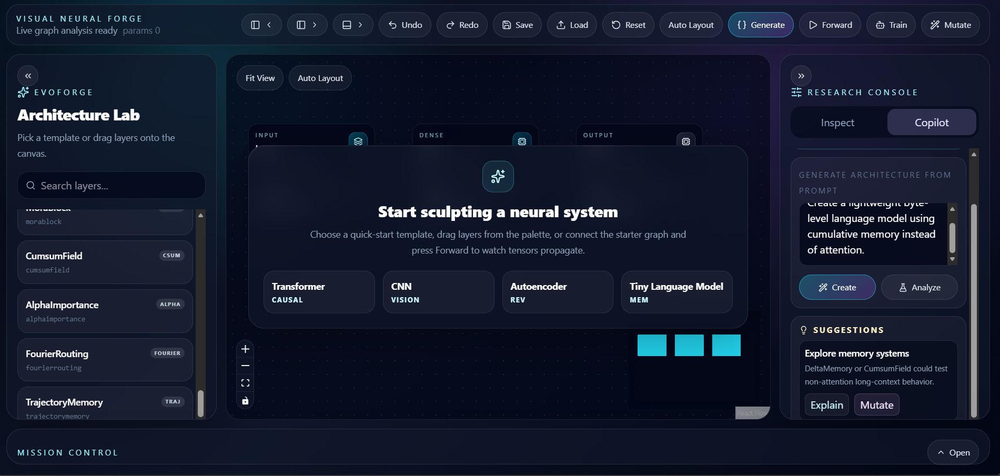

# EvoForge

EvoForge is a full-stack visual neural architecture builder: React Flow for graph editing, Flask for graph parsing, NetworkX for validation, and TensorFlow/Keras code generation and execution.

## What Works Now

- Drag-and-drop neural layer palette.
- Connect, pan, zoom, delete, save, and load visual graphs.
- Edit node parameters in the inspector.
- Generate TensorFlow/Keras functional model code from graph JSON.
- Validate cycles, disconnected graphs, missing inputs, and invalid layer fan-in.
- Show inferred tensor shapes and parameter counts under nodes.
- Run a synthetic forward pass and a small synthetic training loop.
- Extension modules for custom layer codegen and architecture mutation.

## Project Structure

```text
frontend/
  src/
    api/
    components/
    data/
    store/
    styles/
backend/
  app.py
  codegen/
  custom_layers/
  datasets/
  evolution/
  graph/
  layers/
  training/
```

## Run Backend

```bash
pip install -r requirements.txt
python backend/app.py
```

The Flask API runs on `http://localhost:5000`.

## Run Frontend

```bash
cd frontend
npm install
npm run dev
```

The Vite app runs on `http://localhost:5173`.

## Screenshots

Add screenshots or demo images to an `assets/` folder, then reference them here:

```md

```

After adding images, commit them with:

```bash
git add assets README.md
git commit -m "Add project screenshots"
git push
```

## API

- `GET /health`
- `GET /layers`
- `GET /datasets`
- `POST /generate_model`
- `POST /forward_pass`
- `POST /train`
- `POST /custom_layers/generate`
- `POST /evolve/mutate`

## Notes

TensorFlow is imported lazily for `/forward_pass` and `/train`, so `/generate_model` can still be used in lighter environments. The graph/layer registry is intentionally data-driven so future PyTorch, ONNX, HuggingFace export, distributed training, and plugin systems can be added without rewriting the editor.
